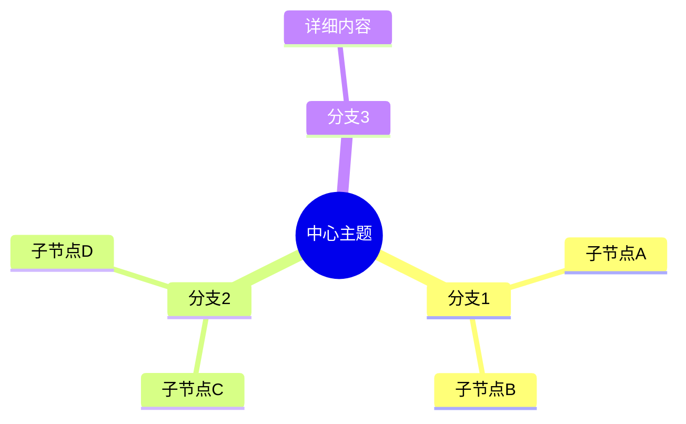
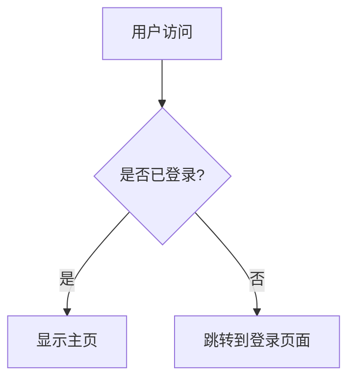
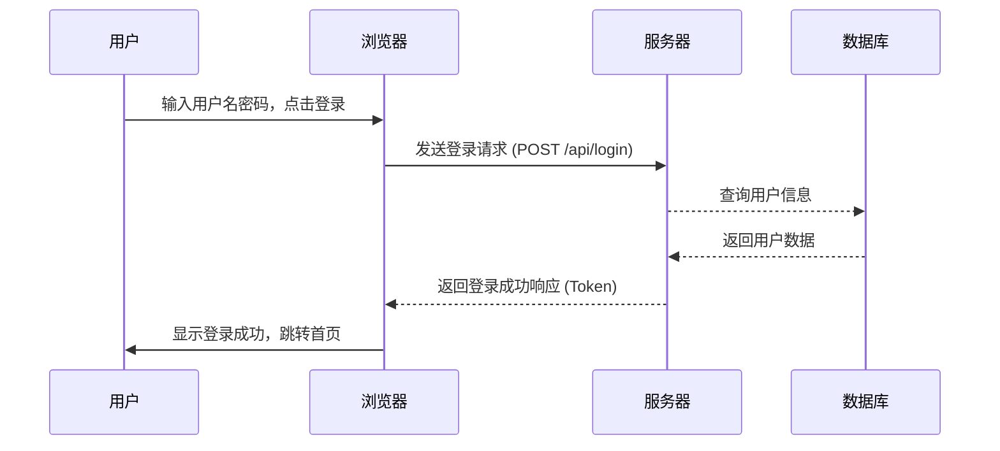

# 思维导图




写法
```markdown
mindmap
  root((中心主题))
    分支1
      子节点A
      子节点B
    分支2
      子节点C
      子节点D
    分支3
      详细内容
```

### Mermaid mindmap 核心语法

Mermaid 的 mindmap 使用缩进（2 空格或 4 空格）来表示层级关系，每一行代表一个节点。节点内容写在特定的符号内，符号决定了节点的外观：

| 符号 | 效果 | 示例 |
|------|------|------|
| `(文本)` | 圆角矩形（默认） | `(分支1)` |
| `[文本]` | 矩形 | `[子节点A]` |
| `((文本))` | 圆形 | `((中心主题))` |
| `{文本}` | 菱形 | `{判断条件}` |
| `>文本]` | 旗帜形 | `>备注]` |

**缩进规则**：一个节点下的子节点缩进量必须比父节点多一个层级单位（通常 2 空格）。同一层级的节点缩进一致。例如：

```markdown
mindmap
  root((主标题))
    一级分支
      二级节点
        三级节点
    另一个一级分支
      另一个二级
```


### 复杂样式与图标

Mermaid 支持在节点文本中加入 **Font Awesome 图标**（需要渲染器支持），格式为 `:icon-name:`。例如：

```markdown
mindmap
  root((:rocket: 项目规划))
    开发
      :computer: 前端
      :gear: 后端
    测试
      :bug: bug修复
```

图标名称参考 [Font Awesome 免费图标](https://fontawesome.com/icons)（仅免费版可用）。


### 颜色定制

可以为节点单独设置背景色或边框色，使用 `:::` 语法跟上 CSS 颜色值（十六进制、rgb 或颜色名）：

```markdown
mindmap
  root((核心概念)):::#ffcc00
    分支A:::red
      子项1:::lightgreen
```

注意：此功能在部分渲染器中支持，如 GitHub 和 Typora 可能不生效，推荐在支持完整 Mermaid 的编辑器（如 Obsidian、Mermaid Live Editor）中使用。

### 注意事项

1. **缩进一致性**：混合使用空格和 Tab 可能导致渲染错乱，建议统一用空格。
2. **节点文本中的特殊字符**：若需使用括号或冒号，可用双引号包裹节点文本，例如 `("含有（括号）的文本")`。
3. **根节点只能有一个**：mindmap 必须从唯一的根节点开始，否则语法错误。
4. **换行**：节点内如需换行，使用 `<br>` 标签，如 `((第一行<br>第二行))`。
5. **兼容性**：原生 Markdown 规范不含 Mermaid，但多数现代 Markdown 渲染器（GitHub、Typora、Obsidian、VSCode 插件等）通过代码块支持。若平台不支持，需安装相应插件或使用在线工具。

### 完整示例

```markdown
mindmap
  root((学习路线))
    编程语言
      Python
        Web框架
           Django
           Flask
        AI
           TensorFlow
           PyTorch
      JavaScript
        前端
           React
           Vue
        后端
           Node.js
    工具
      Git
      Docker
      VS Code
```

渲染效果（示意图）：

```
                ┌──────────┐
                │ 学习路线  │
                └──────────┘
               /     |       \
              /      |        \
         编程语言    工具       ...
          /    \     /|\
      Python  JS   Git Docker ...
      /   \   / \
    Web  AI 前端 后端
```

---

通过以上语法，就可以在 Markdown 中自由创建结构清晰、外观多样的思维导图，无需任何外部图片或软件。记住核心要点：**缩进决定层级，符号控制形状，图标与颜色增强可读性**。
| `[文本]` | 矩形 | `[子节点A]` |




```
graph TD
    A[用户访问] --> B{是否已登录?};
    B -- 是 --> C[显示主页];
    B -- 否 --> D[跳转到登录页面];

```





```
sequenceDiagram
    用户->>浏览器: 输入用户名密码，点击登录
    浏览器->>服务器: 发送登录请求 (POST /api/login)
    服务器-->>数据库: 查询用户信息
    数据库-->>服务器: 返回用户数据
    服务器-->>浏览器: 返回登录成功响应 (Token)
    浏览器->>用户: 显示登录成功，跳转首页
```
